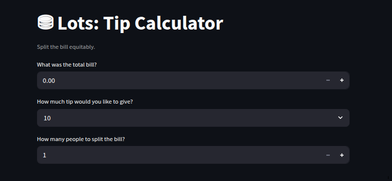

# Lots
## Description

**Lots** is a Python + Streamlit tip calculation app. You can input the total bill, the tip percentage, and the number of people splitting the bill. The app will in turn give you how much each person owes. 

## Motivation
I'm building Lots to practice building and maintaining applications beyond the command line. To that end, I am extremely proud to be expanding into using Streamlit. I am also pleased to make this GitHub repo polished and professional. Surely practicing such things now will make the habit ingrained when I work on larger projects.

## Quick Start

## Usage

## Contributing